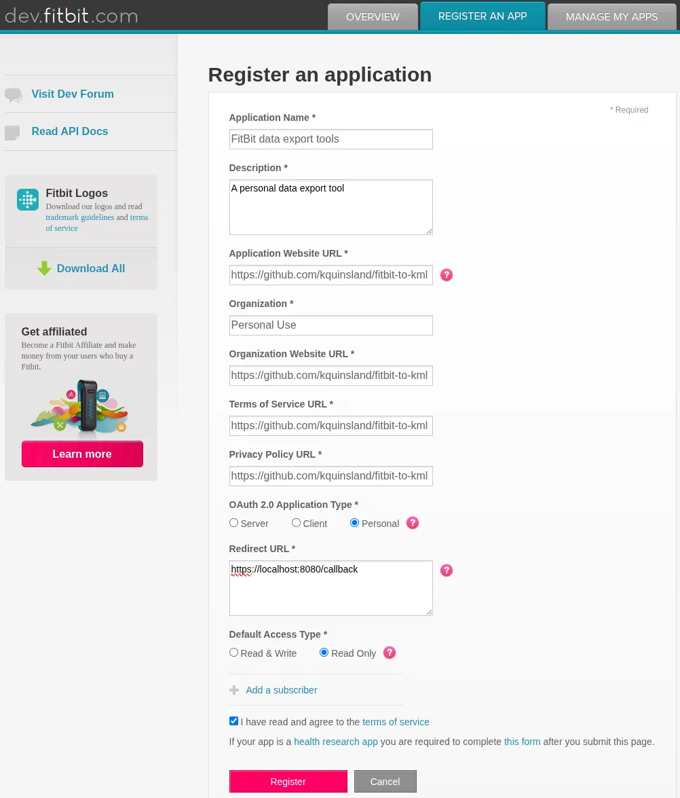
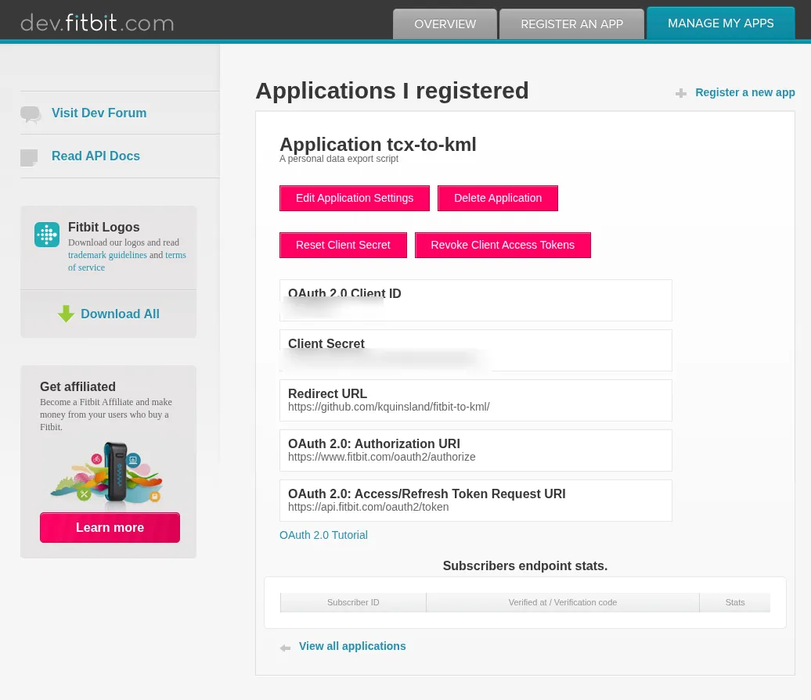

<!-- omit from toc -->
# Obtaining FitBit API Credentials

In order to use the FitBit API, you will need to gain API credentials that can then be used to access user data.

Fortunately, FitBit makes registration of "Personal Use" applications quick and easy.

Once you have an application, you can then consent to give that application access to your own Fitbit data.

- [Steps](#steps)
  - [Register a Fitbit Application](#register-a-fitbit-application)

## Steps

### Register a Fitbit Application

Begin by [registering](https://dev.fitbit.com/apps/new) a new app with Fitbit.
Most of the fields can be filled out with arbitrary values, but pay attention to the following:

- **Application Type**: Choose a [`Personal` application type](https://dev.fitbit.com/build/reference/web-api/developer-guide/application-design/)
- **Redirect URL**: The value of `https://localhost:8080/callback` is hard-coded into the [`get-auth.py`](../get-auth.py) tool; use that unless you know what you're doing.
- **Default Access Type**: Choose `Read-Only`.

After registering, you should be provided with a `Client ID` and `Client Secret`.

> [!note]
> These values are needed for authentication and quite important, so **store them securely**.
> Anybody with these tokens can access your Fitbit data!
